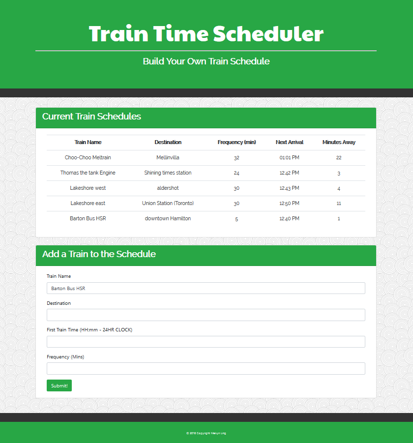
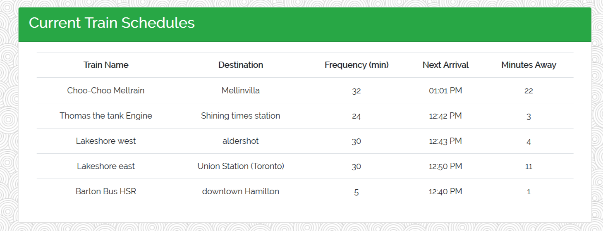
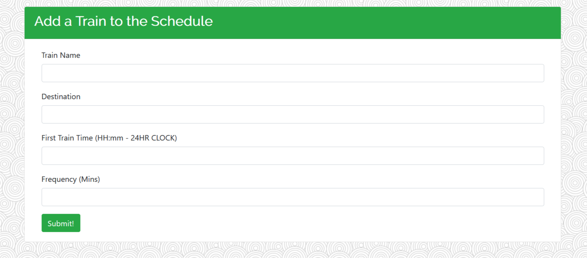

# TRAIN SCHEDULER

------
Check out the live app below!
https://melvynling.github.io/trainscheduler/. 

## Objective
This application lets the user to see when their next train will come and allow the user to plan accordingly.  

## Overview
The application lets the user enter in their train information in the form presented. Once submitted, the user is presented with data as to when their next train will arrive. 

the app uses momentJS to calculate when the users next train will arrive. It also uses google firebase to store the users inputs. Firebase provides a database for the user inputs to be retrieved from every time they visit the page. 

## Instructions/Walthrough
When the page loads, the user is present with a train schedule that displays past inquiries as well as a form that allows the user to input a new train inquiry. 

### The Current Train Schedule:

### Add a Train to the Schedule Form:

the form allows the user to input a new inquiry. 
* All one needs to do is fill out the train's name.
* fill out the train's end place destination
* fill out the first departure time of the train in question
* fill out the train's departure frequency.

Once these are done, hit submit. Once the details have been submitted, the data is sent to google Firebase to be stored and retrieved when needed.

Also once submitted, momentJS is used to calculate when the next train will ariive and how many minutes away it is. This data is presented in the Current Train Schedule above the form.  
